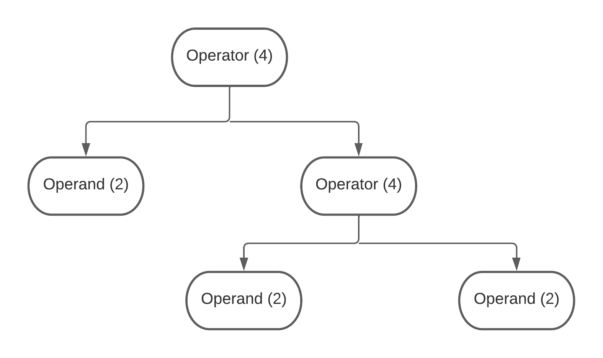

# BasicAssemblyCompiler
A basic assembly compiler converting an XML language to Assembly

# How to read the test file
For each figure, there are 3 corresponding files: c file, asm file, and xml file. C file is created for the readers to understand what the program is doing instead of reading the xml file. XML file is translated from the C file. The xml file is over-written when the program runs the xml file. 

# Supported Figures
## 1. Variable - Argument MicroBenchmark
### Files
* C-file: [micro_benchmark_variable_argument.c](testing/micro_benchmark_variable_argument.c)
* XML-file: [micro_benchmark_variable_argument.xml](testing/micro_benchmark_variable_argument.xml)
* Asm-file: [micro_benchmark_variable_argument.asm](testing/micro_benchmark_variable_argument.asm)

### Description
There are 10 t-registers and 8 s-regsiters in this compiler. They are listed in [harshTable.py](hashTable.py) file. When the program runs out of the registers, it will raise the error. The current version of the xml file will run fine. To test the error case, uncomment the last variable declaration in the xml file. 

Note: This compiler only supports integer type.

### Futher considered improvements:
* Use s-registers when run out of t-registers
* Release unused registers to reuse them

## 2. For MicroBenchmark
### Files
* C-file: [micro_benchmark_for.c](testing/micro_benchmark_for.c)
* XML-file: [micro_benchmark_for.xml](testing/micro_benchmark_for.xml)
* Asm-file: [micro_benchmark_for.asm](testing/micro_benchmark_for.asm)

### Description
This file tests for loop. I include two for loops in this files to see if the count variable for "for loop" increases after one another. 

### Futher considered improvements:
* Nested for loop

## 2. While MicroBenchmark
### Files
* C-file: [micro_benchmark_while.c](testing/micro_benchmark_while.c)
* XML-file: [micro_benchmark_while.xml](testing/micro_benchmark_while.xml)
* Asm-file: [micro_benchmark_while.asm](testing/micro_benchmark_while.asm)

### Description
This file tests for loop. I include two while loops in this files to see if the count variable for "while loop" increases after one another. 

### Futher considered improvements:
* Nested while loop

## 3. Statement-Expression MicroBenchmark
### Files:
* C-file: [micro_benchmark_statement.c](testing/micro_benchmark_statement.c)
* XML-file: [micro_benchmark_statement.xml](testing/micro_benchmark_statement.xml)
* Asm-file: [micro_benchmark_statement.asm](testing/micro_benchmark_statement.asm)

### Description
This file tests statement and expression figures. Here is the supported subset of operation = { +, -, /,* }. This compiler can support up to 3 parameters in the right-hand-side of the statement. For each parameter, we have two cases: label and constant. This section will test all the possible combination of cases. The figure below illustrates cases that we will test with 4 scenarios for operator and 2 cases for operands (label, constant). In total, 128 cases are tested.

### Futher considered improvements:
* Support %, <<, >>
* Expand to unlimited parameters

## 4. If MicroBenchmark
### Files:
* C-file: [micro_benchmark_if.c](testing/micro_benchmark_if.c)
* XML-file: [micro_benchmark_if.xml](testing/micro_benchmark_if.xml)
* Asm-file: [micro_benchmark_if.asm](testing/micro_benchmark_if.asm)

### Description
This file tests IF function. Three IFs are included to see if the compiler can increase the if_count. Three different types of expressions are also tested: label vs label, const vs label, label vs const, and const vs const.

### Futher considered improvements:
* nested if

## 5. Pop_Count Test
### Files:
* C-file: [pop_count.c](testing/pop_count.c)
* XML-file: [pop_count.xml](testing/pop_count.xml)
* Asm-file: [pop_count.asm](testing/pop_count.asm)

### Description
The pop_count.c program will count number of 1 in a number. One note in this compiler is that it only support signed integer while the c file actually need an unsigned integer. 

## 6. Full Test
### Files:
* C-file: [full_test.c](testing/full_test.c)
* XML-file: [full_test.xml](testing/full_test.xml)
* Asm-file: [full_test.asm](testing/full_test.asm)

### Description
This test tests all the figures supported by this compiler, including if, while-loop, for-loop, variables, arguments, and expressions.

